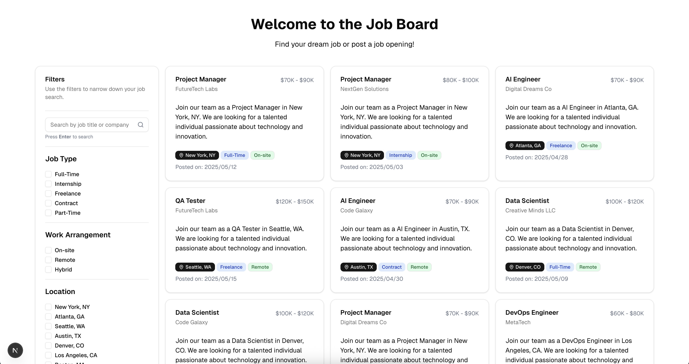
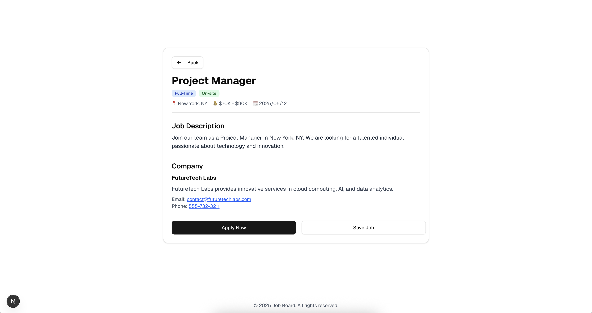

## Requirements

- Node 20.19.0
- NPM 10.8.2

## How to run

1. Install the dependencies:
   ```bash
   npm install
   ```
2. Start the development server:
   ```bash
   npm run dev
   ```

## About

This project is a simple job board application. It uses Next.js, TypeScript, and Tailwind CSS for styling. The application features a job listing where users can search for jobs by title and company, also filter it by location and job type. The filter state is saved in the URL query parameters. So users can share the URL with the applied filters and not lose them when they refresh the page.
The job data is using JSON files for simplicity, but it can be easily extended to use a database or an API.

## Screenshots

1. List of jobs
   

2. Job details
   
